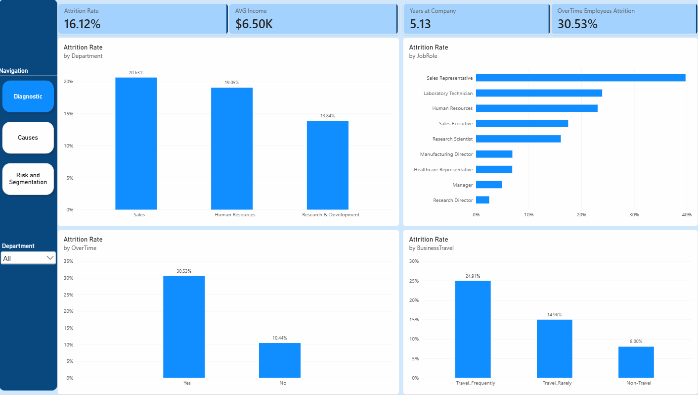

HR Analytics | Employee Attrition Analysis

Power BI · DAX · Python · Scikit-learn · HR Analytics

&#x20; 

**Overview**
Employee attrition is more than an HR metric. When employees leave, companies face replacement costs, productivity loss, onboarding time, and the loss of organizational knowledge.

This project explores the IBM HR Analytics Employee Attrition dataset to understand which employee groups are more likely to leave and which workplace factors are most strongly associated with attrition.

Rather than building a dashboard focused only on reporting turnover, I approached the project as a business case:

Where is attrition concentrated, what factors are associated with it, and where should HR focus its retention efforts?

The analysis combines Power BI and DAX for business intelligence, exploratory analysis for pattern identification, and Python / Scikit-learn to complement the dashboard with correlation analysis, satisfaction profiling, and Random Forest feature importance.

**Business Context**
Employee turnover creates both direct and indirect costs.

Replacing an employee involves recruiting, onboarding, and training, while teams can also experience temporary productivity loss, workload redistribution, and loss of institutional knowledge.

For HR leaders, knowing the overall attrition rate is therefore not enough. The more useful questions are:

Which department has the higher attrition rate?
Is overtime associated with higher attrition?
Are compensation and tenure different between employees who leave and those who stay?
Which job roles deserve the most attention?
How does employee satisfaction differ between retained and departed employees?
Which variables appear most relevant when attrition is evaluated through a machine-learning model?

The goal of this project was to turn these questions into an analytical framework that could support more targeted retention decisions.

**Dataset**
The analysis uses the IBM HR Analytics Employee Attrition \& Performance dataset.
It contains:

1,470 employee records
35 HR-related variables
Demographic information
Job roles and departments
Compensation
Overtime
Years of experience and tenure
Job and environment satisfaction
Work-life balance
Career progression
Employee attrition status

The dataset originally had the columns "EmployeeCount", "Over18" and "StandardHours". Those columns would not generate meaningful insights for this analysis; therefore, they were deleted.

Attrition is used as the main outcome variable, indicating whether an employee stayed with or left the organization.

**Business Questions**
The analysis was structured around five main questions.

1\. How large is the attrition problem?
What percentage of the workforce left the organization, and how is attrition distributed across different employee groups?

2\. Which employee profiles have the highest attrition?
I compared attrition across job roles, departments, overtime status, compensation levels, tenure, and other employee characteristics.

3\. Is overtime associated with employee turnover?
Overtime was analyzed separately to understand whether employees working additional hours showed a materially different attrition rate.

4\. How does the experience of employees who leave differ from those who stay?
Satisfaction indicators — including Job Satisfaction, Environment Satisfaction, Relationship Satisfaction and Work-Life Balance — were compared between both groups.

5\. Which factors are most relevant when attrition is modeled?
A Random Forest classifier was used as an exploratory feature-importance model to identify which variables contributed most to distinguishing employees who left from employees who stayed.

**Methodology**

The project combines descriptive, exploratory, and model-based analysis.

1\. Exploratory Data Analysis
I first explored the workforce across dimensions such as:

Attrition
Age
Monthly income
Job role
Overtime
Years at company
Total working years
Distance from home
Job satisfaction
Environment satisfaction
Relationship satisfaction
Work-life balance

This stage was used to identify patterns and define the most relevant questions for the dashboard.

2\. Power BI \& DAX
Power BI was used as the main analytical and storytelling layer.

DAX measures were created to calculate and compare KPIs such as:

Overall attrition rate
Attrition among employees working overtime
Average monthly income
Total working years\\Attrition

The report was structured to move from diagnosis → causes → risk and segmentation, allowing the user to start with the overall workforce picture and progressively investigate where attrition is concentrated.

3\. Correlation Analysis
A Python correlation heatmap was created to explore relationships between numerical HR variables.

The objective was not to identify causes of attrition, but to understand how workforce variables move together and identify potential relationships worth investigating further. This was particularly useful for variables related to employee experience and career progression, such as:

Age
Total Working Years
Years at Company
Years in Current Role
Years with Current Manager
Monthly Income

4\. Satisfaction Profile
To understand whether the employee experience differed between employees who left and those who stayed, I compared the average scores of four dimensions:

Job Satisfaction
Environment Satisfaction
Relationship Satisfaction
Work-Life Balance

A radar chart was used to create a compact comparison between the two groups. This adds an employee-experience perspective to the operational indicators shown in the dashboard.

5\. Random Forest Feature Importance
I also trained a Random Forest Classifier using Scikit-learn, with Attrition as the target variable.
The model included variables such as:

Overtime
Monthly Income
Age
Total Working Years
Years at Company
Job Level
Job Satisfaction
Environment Satisfaction
Work-Life Balance
Distance from Home
Years in Current Role
Years Since Last Promotion
Years with Current Manager

The goal of this step was not to build a production attrition prediction system, but to use feature importance as an additional analytical lens for understanding which variables were most useful to the model when distinguishing between employees who stayed and employees who left.

**Important:** Feature importance represents predictive relevance within the model. It does not establish that a variable causes employee attrition.

Key Findings

1\. Overall attrition reached 16.1%
Of the 1,470 employees in the dataset, 237 left the organization, resulting in an overall attrition rate of approximately 16.1%.
This means roughly 1 in every 6 employees in the dataset belongs to the attrition group.

2\. Overtime is one of the clearest risk signals
Employees working overtime showed an attrition rate of approximately:
30.5% — Overtime
versus
10.4% — No Overtime

In other words, employees working overtime left at roughly **2.9x the rate** of employees who did not work overtime. This was one of the strongest actionable patterns identified in the analysis.

The result does not prove that overtime itself causes employees to leave, but the magnitude of the difference makes workload and overtime practices a clear area for further HR investigation.

3\. Sales Representatives are the highest-risk job role
Attrition was not evenly distributed across job roles.

Sales Representatives recorded an attrition rate of approximately 39.8%, the highest among the job roles in the dataset, which represents nearly 2 out of every 5 Sales Representatives left the organization.

This suggests that a company-wide retention strategy could miss important local problems. Retention initiatives should be segmented by role rather than applied uniformly across the workforce.

4\. Employees who left earned substantially less
Average Monthly Income also showed a meaningful difference between the two groups.

Employees who left: approximately $4,787/month

Employees who stayed: approximately $6,832/month

That represents a difference of roughly $2,045 per month, with employees in the attrition group earning about 30% less on average.

Compensation should not be interpreted in isolation — income is also related to seniority, job level, and experience — but the gap suggests that compensation structure deserves attention when investigating retention.

5\. Satisfaction alone does not explain attrition
The satisfaction analysis compared:

Job Satisfaction
Environment Satisfaction
Relationship Satisfaction
Work-Life Balance

between employees who left and those who stayed.

Differences exist between the two groups, but the broader analysis **suggests that a single satisfaction metric cannot explain attrition**.

Instead, turnover appears to be associated with a combination of workload, compensation, career stage, tenure, and employee experience. Therefore, attrition cannot be faced as just an "employee satisfaction problem."

6\. Career variables are strongly interconnected
The correlation analysis showed expected relationships between career progression variables such as:

TotalWorkingYears
YearsAtCompany
YearsInCurrentRole
YearsWithCurrManager

and other career-related measures.

This matters analytically because these variables capture overlapping dimensions of employee seniority and career progression. Rather than interpreting each variable independently, they should be evaluated as part of the broader employee career lifecycle.

**From Insight to Action**

The objective of the analysis was not only to describe attrition, but to identify where HR interventions could be prioritized.
Based on the findings, I would recommend four areas of action.

1\. Review overtime exposure
The nearly 3x attrition gap between overtime and non-overtime employees makes workload management a priority.

HR and business leaders should monitor overtime by team, role, and manager. They must also investigate whether the recurring overtime reflects:

understaffing,
workload imbalance,
unrealistic targets,
seasonal demand,
or process inefficiencies.

The goal should not necessarily be to eliminate overtime, but to identify where it has become structural rather than exceptional.

2\. Prioritize Sales Representative retention
With approximately 39.8% attrition, Sales Representatives represent the clearest role-specific risk group.

A deeper retention review should examine:

compensation structure,
workload and targets,
onboarding,
manager support,
career progression,
incentive design,
and overtime exposure.

A targeted intervention is likely to be more efficient than applying the same retention program to every job role.

3\. Review compensation together with career stage
Employees who left earned approximately $2,045 less per month on average than employees who stayed.

However, compensation should be evaluated alongside Job Level, Total Working Years, and Years at Company. A useful next step would be to identify employees whose compensation is low relative to peers with similar roles and experience, rather than simply targeting employees below a company-wide salary threshold.

4\. Build an early-warning retention framework
Instead of waiting for attrition to appear in historical reports, HR could monitor combinations of indicators such as:

Overtime + Low Income + Short Tenure + Low Satisfaction

These factors should not automatically label an employee as someone who will leave. They can instead be used to identify segments that deserve additional investigation, allowing HR teams to allocate retention resources more strategically.

**Dashboard Structure**

The Power BI report follows the analytical journey of the project.

&#x20;**Diagnostic**
Provides the overall view of workforce attrition and the main HR KPIs.

&#x20;**Causes / Associated Factors**
Explores the variables most strongly associated with employee attrition, including overtime, compensation, tenure, and employee characteristics.

&#x20;**Risk \& Segmentation**
Moves from aggregate metrics toward employee segments that present combinations of higher-risk characteristics. The intention is to move the user from:

"How much attrition do we have?"
to:
"Where should we investigate and act?"

**Tech Stack**

Tool	Application:

Power BI - Dashboard development, interactive analysis and data storytelling

DAX - Attrition KPIs, measures and employee segment analysis

Python - Exploratory and statistical analysis

Pandas - Data manipulation and preparation

NumPy - Numerical operations and radar chart calculations

Matplotlib - Correlation heatmap, feature importance and satisfaction visualizations

Scikit-learn - Random Forest classification and feature importance

**Repository Structure**

hr-analytics-employee-attrition/

│

├── README.md

│

├── dashboard/

│   └── HR\_Analytics\_Dashboard.pbix

│

├── python/

│   ├── associated\_factors.py

│   ├── correlation\_heatmap.py

│   └── satisfaction\_profile.py

│

├── screenshots/

│   ├── diagnostic.png

│   ├── causes.png

│   └── risk-segmentation.png

│

├── dax/

│   └── measures.md

│

├── data/

&#x20;   └── README.md

This project was designed to demonstrate more than just dashboard development.

It combines:
Business problem framing
Exploratory Data Analysis
HR / People Analytics
KPI development with DAX
Power BI dashboard design
Python data analysis
Correlation analysis
Machine-learning feature importance
Data visualization
Analytical storytelling
Translating data into business recommendations

The main takeaway from the analysis is that employee attrition is not evenly distributed across the workforce.

Overtime, job role, compensation, tenure, and employee experience provide different pieces of the retention picture. The value of analytics is therefore not simply knowing that attrition is 16.1%, but identifying where that risk is concentrated and where the business can investigate and act first.

**Author**
Gabriel Vitório B. do Nascimento

Data Analytics | Business Intelligence | Power BI | Python

Portfolio project developed using the public IBM HR Analytics Employee Attrition dataset.

